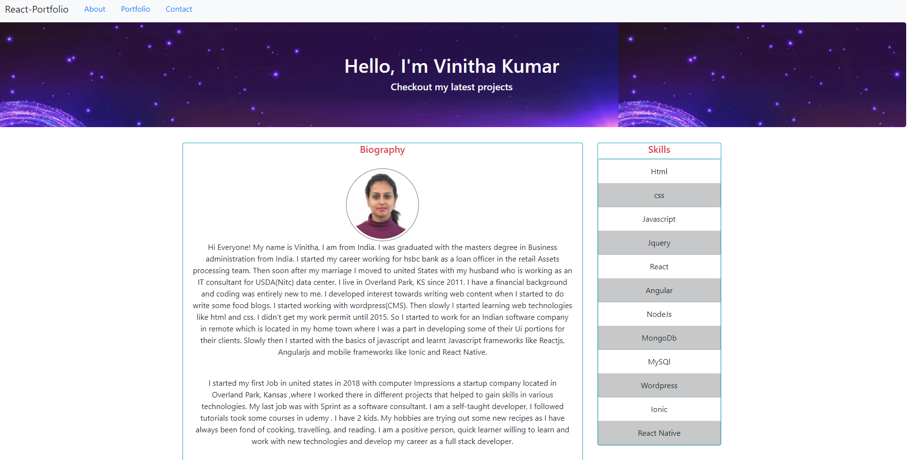
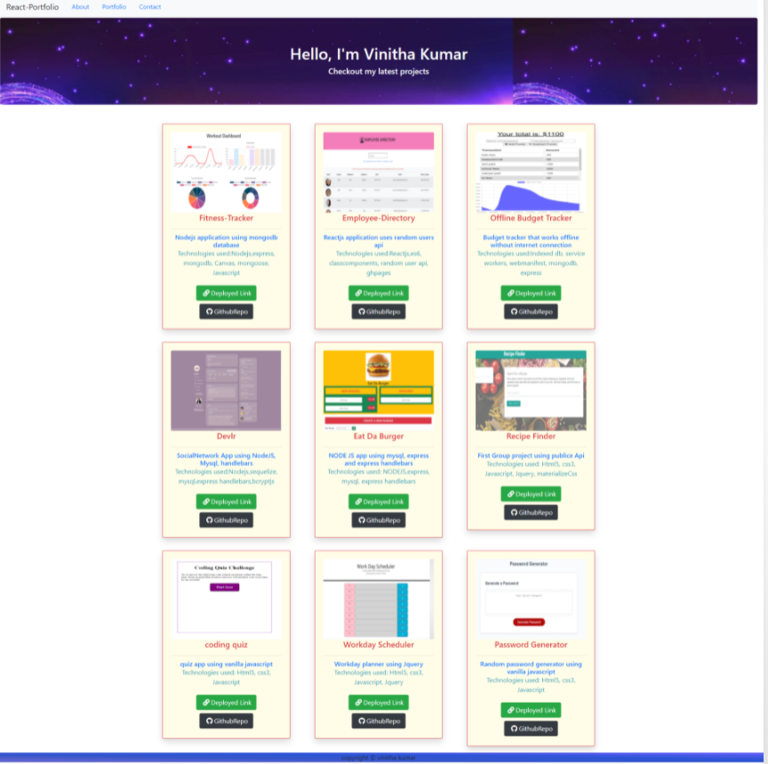
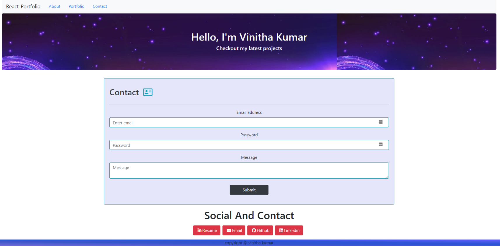

# REACT_PORTFOLIO
Created portfolio of my projects using reactjs.Had to break down
the ui into resusable components.The app is styled using react-bootstrap which has customized components for react,
handled routing using react-router and customized styling for nav links from react-bootstrap. The app is responsive across all width ports and is deployed in gh-pages, used hash router  from react-router as a workaround instead of browser router as gh-pages don't support client side routing.

## Technologies Used
* Reactjs
* jsx
* Javascript
* functional components
* react-bootstrap
* font-awesome
* react-router
* gh-pages

## Screenshots
## About me Page

## Portfolio Page

## Contact Page

The app is deployed in gh-pages. Please visit this link
[react-portfolio](https://selvivini.github.io/react-portfolio/)